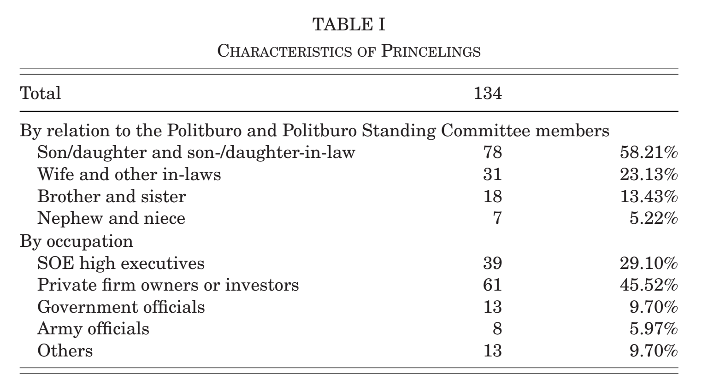
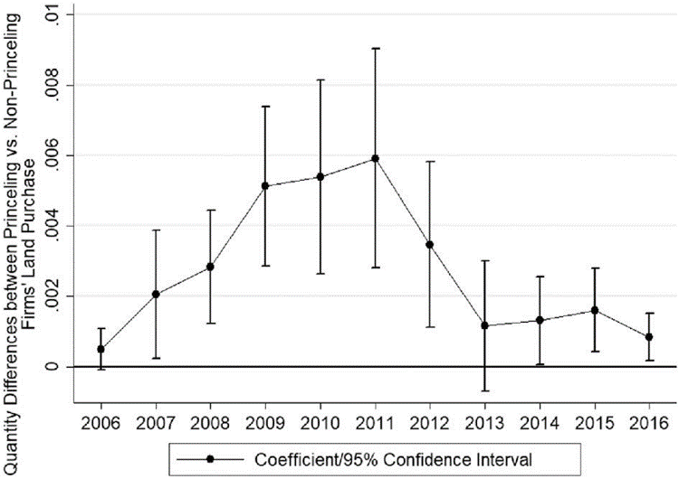

**发布于【蓝鲸OLS实验室】 2019-10-25**

### 【文献阅读】破除“高层政治关联”：中国一级土地市场上的反腐运动

*文献来源：Ting Chen, James Kai-sing Kung , “Busting the ‘Princelings’：The Campaign Against Corruption in China’s Primary Land Market”, The Quarterly Journal of Economics, Volume 134, Issue 1, February 2019, Pages 185–226.*

#### 一、引言

腐败问题是我国当前发展面临的一个十分重要而又现实的问题。典型的腐败是商人通过贿赂有权力的政府官员以换取廉价的国家稀有资源或优先政策对待。而**本文所研究的腐败却是由地方官员提供的，即通过向某些拥有“高层政治关联”的公司——其投资人或所有者与政治局成员存在某种关联——提供价格折扣来换取可能的晋升预期**。这种裙带关系“交易”的普遍性极大破坏了竞争的效率，因此**新任领导人的第一个重大任务就是发起反腐行动以根除腐败**。    

文章使用2004年～2016年间超过100万宗政府作为单一卖家的土地交易数据，运用空间匹配方法，以下面两条主线展开实证研究：  

（1）**地方官员和拥有“高层政治关联”的公司在一级土地市场上的交易让他们双方各自获得多少利益？**   
（2）**国家领导人的反腐败斗争对这一交易的打击效果如何？**

#### 二、背景

##### 1.反腐败运动

我国新任国家领导人上任后不久，发起了一场全面的反腐败斗争。这场运动与以往相比更加强烈和持久，主要特点包括把土地市场作为主要的反腐目标，采取了强化中央纪律监察委、更换任命14个省份的省委书记等一系列措施。此外，最大的突破就是坚持“老虎”“苍蝇”一起打，如逮捕周永康、令计划等。因此，国家领导人向这些政治高层的家庭成员们发送了**一个强烈的信号——绝不容忍任何腐败**。

##### 2.中国的“裙带关系”：一个概念框架

**中国的“裙带关系”是如何运作的？**可以通过下图清晰地显示出来。
  
地方官员拥有对稀缺资源和国有资源的控制权，他们提供价格折扣，给这些与政治局常委或政治局委员有联系的公司，并且能从对方手中获得金钱收益（彻底腐败）或是晋升预期。  

**那么，为什么中国的“裙带关系”是这样运作的？**它基于**两个制度特征**。  

一个是**大范围的国有资产控制权的分散**。以土地为例，国家在1998年通过了一项法案，将地理行政辖区内的土地法律所有权授予当地政府，这使地方官员处于一个特殊位置，他们可以通过向购买者提供大幅折扣以换取某些利益，实施价格歧视。问题是他们会向谁提供折扣？  

另一个是“**上级**”政策，即党和国家内部的委任和晋升由高层人员决定，政治局成员在一个特殊位置上，可以对省级领导——尤其是省委书记的晋升施加影响。为达到政治生涯的顶峰，省领导有巨大的动机向有高层政治关联的公司提供任何形式的优惠。

##### 3.中国一级土地市场的腐败

为什么土地市场**对于研究“高层政治关联”公司和地方官员间的利益交易是非常理想的**？首先，地方政府是土地唯一的所有者和供给人，相当于市场上的垄断者；第二，中国地方财政制度从以企业税为主转变成以土地税为主，导致地市级及以下的地方政府越来越依赖销售土地使用权获得的收入。

#### 三、数据结构

##### 1.有“高层政治关联”的公司

（1）**定义“高层政治关联”**  
我们将“1997年到2016年间任职的精英党员的子女和家庭成员”作为具有“高层政治关联”的对象。在样本中，我们一共找到从15届到18届党的全国代表大会的64名政治局委员。  

（2）**识别具有“高层政治关联”的对象**  
在64名政治局成员中，选择48名，通过丰富的线上媒体资源，找到与其相关的134位具有“高层政治关联”的对象。其中，样本中大约58.21%政治局委员的子女或姻亲，将近一半（45.52%）属于私营部门。这些关系的紧密度让我们对数据的可靠性产生信心。
    

（3）**识别有“高层政治关联”的公司**  
共找到3530家有“高层政治关联”的公司。大部分从事房地产、金融和租赁及商业服务行业，表明一级土地市场是一个租金可供争夺的领域。

##### 2.匹配土地交易和“高层政治关联”的公司

找到国土资源局官网上的数据集，包括2004到2016年中国一级土地市场上的所有土地交易数据（其中披露了每一个具体的交易细节，包括大小、位置、总付款、日期、买卖双方姓名、特定交易方法、两位的土地用途编码、土地质量（官员主观评估，20分制）、三位购买者公司编码）。**将以上获得的“高层政治关联”对象名单和土地交易数据进行匹配**，共找到这段期间内“高层政治关联”公司购买的19812块土地，地理分布如Figure III所示。

##### 3.用于识别的空间匹配样本

假设在同一地区和同年出售同样大小的土地在质量和价格上具有高度可比性，为了确保同类比较，**生成一个在同年和相同距离内由“无高层政治关联”公司购买的土地交易样本**。例如，500m半径内（3块），1500m半径内（8块）。总共能挑选出由“无高层政治关联”公司购买的1500m半径内的359539块土地和500m半径内的207564块土地。

#### 四、“高层政治关联”公司实施的价格折扣

**估计价格折扣的回归模型**为：  

*Priceickst=β0+β1PrincelingPurchaseikjt+γXi+Tcst+vickst*  

**因变量***Priceickst*：在t月-年地方政府c出售给公司k用途为s的土地i价格的对数；  

**解释变量***PrincelingPurchaseikjt*：虚拟变量，如果公司k与“高层政治关联”对象j有关系，值为1，否则值为0；  

**控制变量**：包括销售土地面积的对数、土地质量、交易方法、公司规模及公司所有权等。  

模型使用了**高维的城市—年—用途固定效应、月固定效应和三位行业固定效应**，并将**标准差按照省和公司进行双向聚类**，以消除不同类别下存在的个体差异。

回归结果在Table V中显示：  

（1）在全样本下，表示“**高层政治关联**”**公司购买对土地价格的影响在0.1%的显著性水平下显著**； 
 
（2）和（3）在一定范围内处理了**选择偏差**问题：“高层政治关联”公司购买对土地价格的影响也是显著的。如在500m的半径内，“高层政治关联”公司的价格折扣是57%（根据系数-0.844计算得到）。
  

为确保结果不受异常值扰动，FigureIV说明绝大多数情况下“高层政治关联”公司支付的更少。 
 
考虑到除了“高层政治关联”公司的购买，还有“**高层政治关联**”**对象的权力**或他们**退休后是否可以继续影响人事任命的额外影响因素**，将*PrincelingPurchaseikjt*分别和虚拟变量*PSCMjp*和*Retiredjpt*进行**交互**。（4）至（6）表示“高层政治关联”公司和政治局常委的联系使价格折扣增加了17.6%(exp(-0.62)-exp(-0.62-0.396)=0.176)到20.7%(exp(-0.545)-exp(-0.545-0.442)=0.207)。（7）至（9）表示政治局成员退休后，价格折扣并没有减少，说明**退休并不影响权力的持续**。  

为确保估计不受选择性或不实报道的选择偏差影响，进行两种**稳健性检验**。使用两个小但精确的子样本进行检验。一个是与周永康及其儿子有联系的不同商业团体，另一个是一家有“高层政治关联”的上市公司在一级土地市场上的土地购买，结果发现折扣估计值几乎和我们之前的估计值一致（Table AII）。
  

#### 五、商业优惠对晋升的作用

为了**研究“高层政治关联”公司购买对官员晋升的影响**，使用2004年—2016年省级面板数据，建立**Ordered probit模型**：  

*Turnoverit=∅0+∅1PrincelingPurchaseit+∅2FactionalTiesjt+∅3GDPGrowthit+κXit+ωWj+λi+Tt+φj+τijt.*  

**因变量***Turnoverit*是按年计量的省级官员的政治更替：晋升=3，横向调动或留任=2，退休=1，停职=0；  

**自变量***PrincelingPurchaseit*是虚拟变量（同上）； 

为了避免其他混淆效应，控制“经济表现”(以GDP或税收增长率作为代理变量)和“派系关系”(FactionalTiesjt)两个变量；  

**其他控制变量**还有省级官员的个人特征如年龄、年龄平方和受教育年限等。  

另外，为防止虚拟变量*PrincelingPurchasept*缺少由地方政府提供的折扣幅度信息，可以**使用PrincelingDiscountspt**（500m范围内“高层政治关联”公司和相对应的“无高层政治关联”公司交易价格的差值）**和AreaofLandPurchasedit**（出售给“高层政治关联”公司的土地数量）**进行替换，以构建一个更精确的测量方法**。  

检验结果显示在Table VIII：
 

发现那些给“高层政治关联”公司供折扣的**省委书记的晋升可能性增加**了23.4%，晋升可能性随着价格折扣的大小和“高层政治关联”公司购买土地数量（面积）的增加而增加。但对于**省长，他们必须通过提高其管辖范围内的经济水平或GDP增长来获得晋升**，只有省委书记能够从投机和交易中获得好处。 
 
**一个可能的假设**是省份提供折扣以吸引更多的投资，实现了更高的增长率，导致**省级官员的晋升不是由于他们提供了优惠，而是因为他们能够促进更快的经济增长**。选取与投资增长有关的**代理变量**，Table AIII显示GDP增长在党委书记晋升的原因中无足轻重，因此**拒绝关于增长促进晋升的替代假设**。
 

对于市级官员，他们作为一级市场中的土地保管人，**省委书记在出售廉价土地给“高层政治关联”公司时也需要市级官员的合作**。其估计结果与省级类似（略）。

#### 六、国家领导人反腐运动的效果

要**研究我国领导人反腐运动的效果**，需要建立**三种指标**，分别是“transactions after 2012”，“central inspection”和“Xi-appointed officials”，分别表示“2012年后的交易”，“中央检查”和“由领导人任命的官员”。

##### 1.土地价格
Table X显示了**反腐运动对“高层政治关联”公司获得价格折扣降低的作用效果**：
 

结果表明“**中央检查**”和“**由领导人任命的官员**”更加有效，价格折扣分别显著降低了42.6%(exp(-0.858+0.695)-exp(-0.858)=0.426)(4)和31.5%(exp(-0.896+0.572)-exp(-0.896)=0.315)(6)。Figure V概括了一段时间内“高层政治关联”公司获得平均折扣的大小，显示了在反腐运动之后，折扣明显收缩，到2016年基本消失。
 

##### 2.“高层政治关联”公司的土地购买量
Table XI显示：**反腐运动对“高层政治关联”公司购买土地数量产生的下行压力**。同样地，后两种措施显得更加有效。
 

Figure VI清晰地显示，在反腐运动之前，两类公司估计数量的差异随时间的推移呈增长趋势，但在运动之后，数量差异明显下降。
 
##### 3.政治更替
与估计一致，Table XII显示了**反腐败运动降低了这些依赖提供折扣的地方官员的晋升预期**。
 
##### 4.周永康事件研究
为了**进一步证实反腐运动的效果**，利用高调被捕的周永康案例，我们假设为了避免被捕，地方官员可能在其因腐败被逮捕的第二天，停止向报道中与周有联系的“高层政治关联”公司提供优惠。Figure VII表示：在消息之后，这些“高层政治关联”公司得到的价格折扣明显减少，土地交易总量有所下降，表明一部分当地官员做出谨慎的反应。
 
#### 七、结论
通过实证分析，得出结论:**“高层政治关联”公司和地方官员的腐败交易,使“高层政治关联”公司获得了55.4%到59.9%的价格折扣**，同时**购买的土地面积也增加**了；**省委书记的晋升预期增加**了23.4%，具有“高层政治关联”对象的**权力越大，晋升预期越高**。  

国家领导人开展的**反腐斗争**，使**腐败率降低了42.6%到31.5%**，且使依赖这一交易的**地方官员晋升预期下降**。  

以上的所有发现提供了足够证据，使我们了解这场反腐运动的严肃性。尽管**到目前为止，反腐运动已经取得了积极效果，但在没有彻底改变现有制度安排情况下，腐败能否完全根除，仍然是一个根本性的重要问题**，在未来仍非常值得探讨。